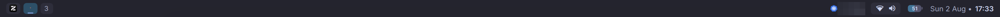
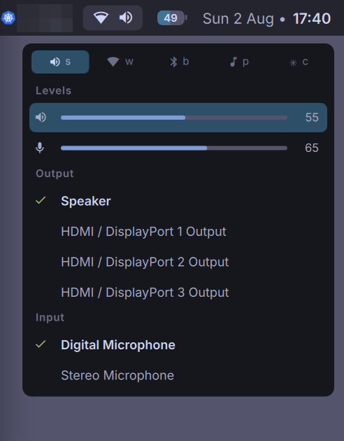
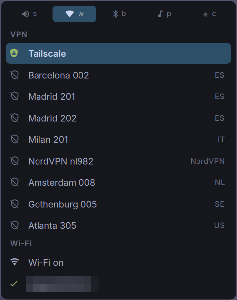
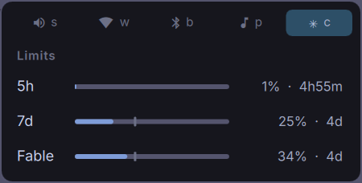
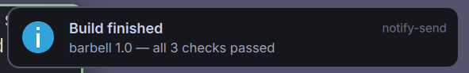
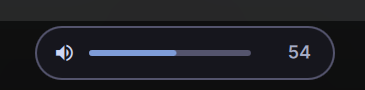

# barbell

A bar for the [niri](https://github.com/YaLTeR/niri) compositor, written in
[quickshell](https://quickshell.org) QML. Successor to an ags/Astal bar, and to
a gpui experiment before that, because I thought it would be easy to write
something in GPUI, which turned out to be harder than I thought. I really wanted
something keyboard driven, as I grew tired of navigating menus in my previous
ags bar by hand. I bound `barbell ipc call menu open` to `Mod+;`, and can do
most things inside of this menu using just vim-motions. It turns out that this
is great UX.

The name barbell doesn't really have a correlation to this project other than
that this is a bar. I asked opus to come up with funny names and it failed.

I originally used Ags to write my bar. I might go back to that in the future
again, I have yet to see. I wanted to try out quickshell, but I didn't really
have time to properly look into. That's why this project, and the rest of this
readme, is entirely written by AI.



> **AI disclaimer:** this bar was slopped out in roughly a day with Claude Code,
> and it shows in the commit log. The design opinions are mine; most of the QML
> is the machine's. Read it in that spirit.

## Features

- **One bar per monitor**, top or bottom. Workspace pills show the apps on
  each workspace; scrolling on the pills pans niri's window view.
- **A keyboard-first menu system** — one bind opens a tabbed card: sound,
  wifi, bluetooth, media players, Claude usage. vim motions, incremental
  search, no mouse anywhere (the mouse works too).
  - **sound** — volume/mic sliders, mute, switch output and input devices
  - **wifi** — VPN profiles and wifi networks, connect/disconnect
  - **bluetooth** — pair, connect, disconnect
  - **media** — every MPRIS player, play/pause, jump to its window
  - **claude** — Claude Code rate-limit windows with pace projections
- **A notification daemon** — implements `org.freedesktop.Notifications`
  directly, with icons and clickable actions. No dunst/mako needed.
- **Volume and mic OSD** on the opposite screen edge from the bar, for
  changes made outside the menu (media keys, `wpctl`).
- **Status that only appears when it's news** — battery, wifi, VPN,
  bluetooth, mic-in-use, CPU/memory pressure, kube context, Claude usage.
  See [interest rules](#interest-rules) for why half of these are usually
  invisible.
- **Theming** via semantic tokens — Kanagawa ground with Catppuccin text,
  plus a light variant driven by `theme.json`.
- **Scriptable** — `barbell ipc call menu open` (or `audio`, `network`,
  `close`, …) drives the running bar from anywhere.
- **Packaged as a nix flake**; edits hot-reload during development.

| the menu, tucked under the bar | the wifi tab | the claude tab |
|---|---|---|
|  |  |  |

| a notification | the volume OSD |
|---|---|
|  |  |

## The keyboard is the interface

`barbell ipc call menu open` (bound to Mod+; in niri) opens the audio menu.
From anywhere inside:

- `s` / `w` / `b` / `p` / `c` — sound, wifi, bluetooth, player, claude tabs
- `j`/`k`, `g`/`G`, `[`/`]` — rows, ends, sections (`]` lands on the active device)
- `h`/`l` — nudge: volume on audio rows, prev/next on players
- `/` — search (`Ctrl-j/k` to move while typing), `Enter` — act, `Esc` — out
- `m` — mute (audio), `f` — focus the player's window (media)

## Workspaces


One pill per niri workspace, per monitor. A workspace with windows shows their
app icons instead of a number, ordered as they appear on screen — niri reports
pixel positions for windows in view and `[column, row]` indices for windows
scrolled out of it, so the in-view windows sort first by position and the rest
trail in column order, rather than interleaving two units that don't compare.

The highlighted pill is the active workspace, and the focused window carries
an accent underline beneath its icon — so the bar answers "where am I, and in
what" at a glance. An empty workspace is just its number, dimmed, red when
urgent.

Click a pill to switch to that workspace. Scrolling on the pills pans the
scrolling layout a column per notch (wheel-up pans left, as in a document);
trackpad deltas accumulate so a gesture steps columns instead of flinging
them.

## Interest rules

**The bar shows exceptions, not state.** Anything whose value doesn't change
what you'd do next belongs in a menu you open deliberately, not on the bar.
CPU at 80% only ever means "go look" — so the bar carries the *trigger* and the
readout lives wherever you'd actually diagnose it. The bar notices, the menu
contextualises, btop investigates. (The resource menu isn't built yet; the bar
trigger is, so today CPU/memory go straight from bar to btop.)

Each component is encoded by when it's *interesting*:

| | drawn when |
|---|---|
| Battery | always |
| Wifi | off, or on a network that isn't yours |
| VPN | up — but never tailscale, on by default = not news |
| Bluetooth | off, or a device connected |
| Speaker | always — it's also the button into the audio menu |
| Mic | in use, or muted |
| CPU / memory | past an interrupt-worthy threshold, and then *with* the number |
| Kube context | always — wrong-cluster mistakes are expensive |
| Claude usage | projected to blow the window, not merely high |

Two of those are worth their exceptions. The mic's loudest state is **muted
while something is listening** — the only mic state that's a *mistake* rather
than a setting. And Claude usage keys on pace rather than level: 16% five days
out is fine, 60% on reset day is not, so what surfaces is the linear
projection, with `↗` saying the trend is the problem.

Corollaries that keep getting reused:

- A container implies contents, so an empty one reads as broken. Capsules wrap
  only what's always present and always full — which makes *anything not in a
  capsule something that isn't normally there.*
- A summary must never look calmer than what it summarises.
- Grey is "you turned it off", red is "it broke". Deliberate isn't an error.
- A shorter label that misleads is worse than a longer one that doesn't — hence
  18 chars for SSIDs, enough to keep the colon in `Researchable: work from…`.
- If the UI needs a legend, the encoding is wrong.

Rejected on the way here, all of them ways to compress something that didn't
need to be on the bar at all: pills, reserved-width slots (leaves holes),
dimming instead of hiding, shrink-to-dot, collapsing clusters (shifts), and one
summary dot (throws away the information the three dots carried).
`design/DECISIONS.md` has the full reasoning.

## Running it

```sh
systemctl --user stop barbell   # if a packaged copy owns the notification socket
nix develop
quickshell -p .                 # edits hot-reload, no restart
```

`design/DEVELOPING.md` covers the rest of the local loop — detached runs,
single-widget previews, and the kill/restart traps.

Packaged: `nix build` gives a `barbell` wrapper that runs the bar from the
store; `barbell ipc call menu open` talks to the running instance without
knowing any store path. My nixconfig consumes this as a `git+file` flake
input — commit here, `nix flake update barbell` there.

## Layout

```
shell.qml              Variants over Quickshell.screens + the menu IpcHandler
Theme.qml              Kanagawa ground, Catppuccin text, all semantic tokens
modules/Bar.qml        the PanelWindow; Island.qml groups the connectivity icons
modules/Menu.qml       the whole keyboard model — menus only supply rows
modules/*Menu.qml      audio / network / bluetooth / media / claude
services/Niri.qml      niri IPC event stream -> workspaces + windows
services/ClaudeUsage.qml  statusline-hook file + OAuth usage endpoint
```

## Gotchas that cost a debugging round

- **Bindings track properties, not function results** — name the property.
- **Reordering a Repeater model rebuilds every delegate**, restarting
  animations. Keep list order stable; mark the active row instead.
- A **hoverEnabled MouseArea swallows hover** rather than passing it down.
- **Pipewire.ready is false at startup**; filter sinks on `PwNodeType`, never
  on a property that starts empty.
- `QT_QPA_PLATFORMTHEME=gtk3` or every app icon comes up empty (set in flake).
- wlr screencopy returns frozen frames while the session is locked —
  `barbell ipc call menu dump` exists so state is checkable blind.
- **Singletons are lazily instantiated**, so a `FileView` that works standalone
  reads empty until something has actually constructed the singleton.
- **`pkill -x quickshell` never matches** (store path), and `pkill -f` matches
  your own shell. Kill by PID. Never glob `/nix/store`.
- `nix flake` ignores untracked files — `git add -N` before blaming the overlay.
- Not every icon is square: `neovim.svg` is 602×734, so an `Image` without
  `PreserveAspectFit` renders it taller and heavier than its neighbours.
- **Don't add `barHeight` to a popup's margin.** The bar claims it as an
  exclusive zone, so the compositor already places surfaces clear of it.
